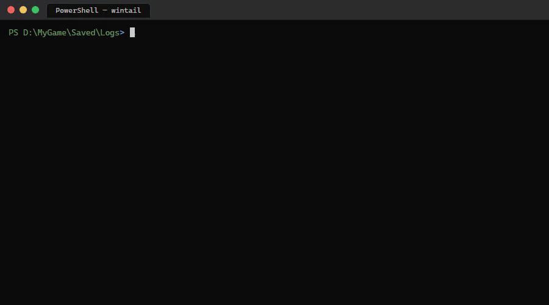
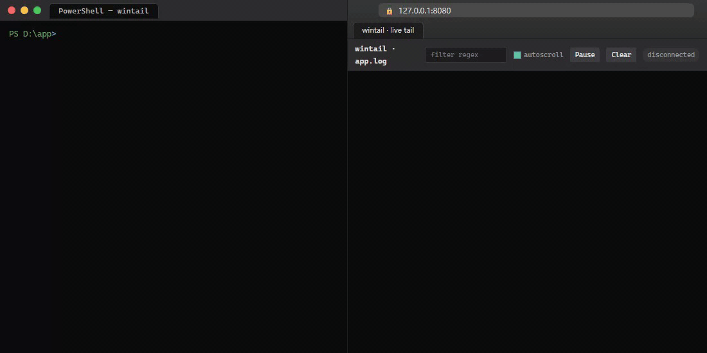
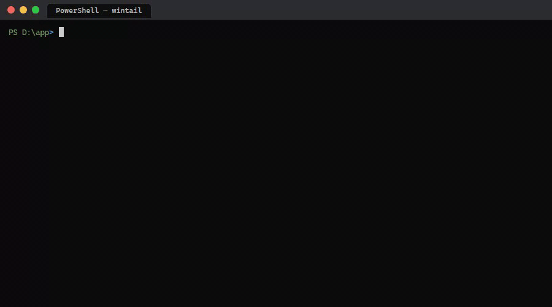
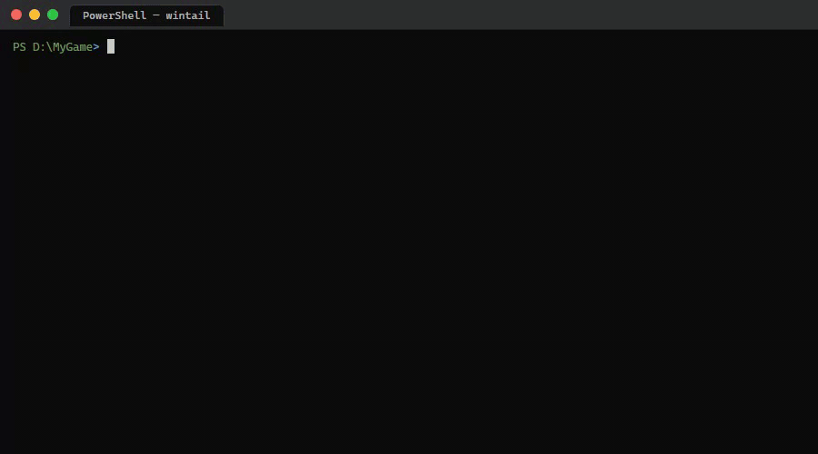

# wintail

`tail` for PowerShell and Windows. Behaves like GNU `tail` but adds color, grep, JSON filtering, time-window slicing, Unreal Engine log mode, Windows toast notifications, browser-based live tail with SSE, Slack/Discord webhooks, command-watcher mode, plugins, and 50+ other flags. **Zero dependencies, single `npx` command.**



```powershell
npx github:1206660/wintail app.log              # last 10 lines
npx github:1206660/wintail -F -G ERROR app.log  # follow, only errors, in red
npx github:1206660/wintail -F app.log --web=:8080  # browser-based live tail
```

### More demos

**Browser-based live tail** — `wintail -F app.log --web=:8080` (terminal & browser sync over SSE; ANSI translated to HTML; browser-side filter)



**JSONL filter & extract** — `--json-filter level=error --json-extract '[{ts}] [{level}] {service} → {msg}'` (raw JSONL → clean projected lines)



**UE log triage with on-exit summary** — `wintail --ue --summary <Project>.log` (UE channel/severity colors during stream; pattern-normalized top-N table on Ctrl-C)



PowerShell's built-in `Get-Content -Wait -Tail` is slow on big logs, doesn't follow log rotation, and lacks every feature you reach for from real `tail`. `wintail` is the `tail` you already know — `tail -f`, `tail -F`, `tail -n 100`, multi-file headers — and then 50+ more flags for live log reading.

---

## Install

```powershell
# zero-install (recommended for one-off use)
npx github:1206660/wintail app.log

# global install
npm install -g wintail
wintail app.log

# in PowerShell, make `tail` work like Linux:
wintail --install-alias
# (then open a new shell — `tail file.log` now calls wintail)

# enable shell tab completion
wintail --completion=powershell | Out-String | Invoke-Expression
wintail --completion=bash | source /dev/stdin
```

Requires **Node.js ≥ 18**. Node 22+ for glob expansion of `*.log` style args.

---

## What it does

### GNU tail compatibility (the basics)

| | |
|---|---|
| `wintail file` | Last 10 lines |
| `wintail -n 50 file` | Last 50 lines |
| `wintail -n +100 file` | From line 100 to end |
| `wintail --head=20 file` | First 20 lines (the GNU `head` companion) |
| `wintail -c 1k file` | Last 1024 bytes |
| `wintail -f file` | Follow appends (Ctrl-C to stop) |
| `wintail -F file` | Follow by name — survives log rotation |
| `wintail --tail-from-now -F file` | Skip backlog; only show appended-from-now lines |
| `wintail a.log b.log` | Multi-file with `==> name <==` headers |
| `Get-Content big.log \| wintail -n 5` | From a pipe |
| `wintail --pid 1234 -f file` | Stop following when PID dies |
| `wintail -s 0.5 -f file` | Polling interval (default 1s) |
| `wintail --encoding=utf16le file` | UTF-16LE input (BOMs auto-detected) |
| `wintail --reverse -n 50 file` | Last 50 lines, newest first |

### Color & highlighting

| | |
|---|---|
| `--color={auto,always,never}` | Default `auto` (TTY + no `NO_COLOR`) |
| Built-in highlights | `ERROR`/`Fatal`/`panic` red bold, `WARN` yellow, `INFO` cyan, `DEBUG`/`Verbose` dim |
| `--theme=NAME` | Color preset for built-ins: `default`, `dracula`, `solarized`, `monokai`, `nord`, `github`, `high-contrast` |
| `--highlight=PAT=COLOR` | Custom highlight (repeatable). `'panic=red bold'`, `'TODO=yellow'` |
| `--no-default-highlight` | Disable built-ins |
| `--no-color` / `--color=never` / `--plain` | Strip all colors |
| `--strip-ansi` | Remove existing ANSI codes from input |

### Filter

| | |
|---|---|
| `-G PAT` / `--grep=PAT` | Keep matching lines (repeatable, OR by default) |
| `--grep-and` | Require ALL `--grep` patterns to match (AND) |
| `--grep-v=PAT` | Drop matching lines (repeatable) |
| `-i` / `--ignore-case` | Case-insensitive grep |
| `-C N` / `--context=N` | Show N lines before AND after each grep match |
| `-B N` / `--before-context=N` | Just before-context |
| `-A N` (digits) | Just after-context (bare `-A` = `--show-nonprinting`) |
| `--include-from=FILE` | Load `--grep` patterns from file (one per line, `#` for comments) |
| `--exclude-from=FILE` | Same, for `--grep-v` |
| `--since=SPEC` | Drop lines older than SPEC. `5m`, `1h`, `2d`, `10:30`, ISO 8601, UE `[YYYY.MM.DD-HH.MM.SS:ms]`. Multi-line stack traces inherit the previous line's timestamp. |
| `--until=SPEC` | Drop lines newer than SPEC. Combine for windows. |
| `--every=N` | Sample 1 in every N lines (per source) |
| `--rate-limit=N` | Cap to N lines/sec per source; drop overflow with `[wintail: K dropped]` summary |
| `--collapse-repeats` | Suppress consecutive identical lines |
| `--squeeze-blank` | Collapse runs of blank lines to one |

### Transform

| | |
|---|---|
| `-N` / `--line-number` | Prefix `123\t` (per source) |
| `--prefix=TEMPLATE` | Prefix every line. `{source}` `{time}` substitutions. |
| `--add-timestamp[=FMT]` | Wall-clock time prefix. FMT: `time` (HH:MM:SS), `iso`, `epoch`, `epoch-ms` |
| `--tag PAT=LABEL` | Prepend `[LABEL]` (colored) to lines matching PAT |
| `--truncate[=N]` | Truncate to N visible chars (default = terminal width) with `…`. ANSI-aware. |
| `--regex-extract=PAT` | Emit only captured groups (or full match if no groups). Drops non-matching lines. |
| `--max-lines=N` | Emit at most N lines (post-filter) then exit |
| `--limit-bytes=N` | Emit at most N bytes (post-filter) then exit |
| `-A` / `--show-nonprinting` | Replace control bytes with `^M` / `^@` / `\xNN` glyphs |
| `-z` / `--null-data` | Treat NUL byte as input line separator |

### JSONL logs

| | |
|---|---|
| `--pretty-json` | Detect JSON lines and pretty-print with 2-space indent |
| `--json-filter=EXPR` | Keep matching JSON lines. EXPR: `key=val`, `key!=val`, `key>=N`, `key>N`, `key<=N`, `key<N`, `key~regex`, `key!~regex`, or just `key` to require existence. Dot-paths: `user.role=admin`. Repeatable (AND). |
| `--json-extract=SPEC` | Project to clean text. Either comma paths (`level,msg,user.id`) or template (`'[{ts}] [{level}] {msg}'`) |
| `--json-keep-non-json` | Don't drop non-JSON lines |

### Unreal Engine

| | |
|---|---|
| `--ue` | UE log mode: parse `[ts][frame]Channel: [Severity: ]Message`. Color each Channel deterministically (12-color palette via stable hash). Severity: Error red bold, Fatal magenta bold, Warning yellow, Verbose dim. Indented continuation lines (stack frames) dimmed. |

### Live tail in browser

| | |
|---|---|
| `--web=SPEC` | Expose live tail at `http://HOST:PORT/`. Inline page with EventSource stream, ANSI→HTML, browser-side regex filter, pause/resume/clear. |
| `--web-token=TOKEN` | Required for non-loopback bind; URL becomes `?token=TOKEN`. |
| `GET /events` | SSE stream (one event per line) |
| `GET /health` | JSON `{ ok, uptime_seconds, lines, subscribers, title }` |
| `GET /metrics` | Prometheus text format (gauge: `wintail_uptime_seconds`, `wintail_subscribers`; counter: `wintail_lines_total`, plus `wintail_errors_total`, `wintail_warns_total`, `wintail_lines_per_source{...}` when `--stats` is on) |

### Notifications

| | |
|---|---|
| `--notify-on=PAT[=TITLE]` | Windows toast on match. Repeatable. Throttled 1/pat/5s. Non-Windows: silent no-op. |
| `--webhook=PAT=URL` | POST to URL on match. Auto-detects Slack (`hooks.slack.com/...`), Discord, generic format. Throttled 1/spec/5s. |

### Output / capture

| | |
|---|---|
| `--save=FILE` | Tee output to FILE (ANSI stripped by default) |
| `--save-append=FILE` | Same but append to existing file |
| `--stats[=N]` | Every N seconds (default 10), print to stderr: total lines, errors, warnings, recent + average lines/sec, top 3 files. Final summary on exit. |
| `--mark[=N]` | With `-f`, periodic visual time separator to stderr (default every 60s). |
| `--summary[=N]` | On exit, print top N (default 10) most-frequent line patterns. Numbers/IPs/timestamps/UUIDs/hex normalized — `user 1` and `user 2` collapse into one bucket. Log triage in one flag. |
| `--exit-code-on-match=PAT[=CODE]` | Exit non-zero (default 1) if any line matched PAT. CI-friendly. |

### Files & glob

| | |
|---|---|
| `wintail *.log` | Glob auto-expanded (Node 22+ `fs.globSync`) |
| `wintail dir/` | Directory expands to its `*.log` files |
| `--dir-glob=PATTERN` | Customize directory expansion (default `*.log`) |
| `wintail rotated.log.gz` | `.gz` files auto-decompressed (read mode only) |

### Special modes

| | |
|---|---|
| `--diff a.log b.log` | Multi-set diff between two files: lines only in A `-`, only in B `+`. |
| `--diff-show-common` | Include common lines (prefixed ` `) |
| `--replay[=RATE]` | Walk a static log file at the speed implied by parsed timestamps (RATE multiplies; default 1, 2 = double). For demos, walkthroughs, post-mortems. |
| `--watch=CMD` | Run shell command CMD periodically (`--watch-interval=N`); stream each invocation's stdout through the pipeline. Replaces FILE args. |
| `--resume[=N]` | Pick from last 5 unique commands and re-run. With `=N`, jump straight to that index. |
| `--history` | List last 20 invocations (with timestamps) |
| `--plugin=PATH` | Load custom JS transform from PATH. CommonJS exports a function `(line, ctx) => string|null`, an array of functions, or `{ transform }` / `{ transforms }`. Repeatable. |

### Config files

| | |
|---|---|
| `.wintailrc` (auto-discovered) | JSON file in cwd or `~/`. Maps wintail flags to JSON keys (use shorthand: `grep`, `highlight`, `pretty-json`). |
| Profiled format | `{ "default": {...}, "errors": {...}, "ue-debug": {...} }` |
| `--config=FILE` | Override discovered config |
| `--no-config` | Ignore discovered config |
| `--profile=NAME` | Pick named profile from a profiled config |

### PowerShell convenience

| | |
|---|---|
| `--install-alias` | Add `Set-Alias tail wintail` to your `$PROFILE.CurrentUserAllHosts`. Idempotent. |
| `--uninstall-alias` | Remove that line |
| `--completion={powershell,bash,zsh}` | Print a tab-completion script. `wintail --completion=bash \| source /dev/stdin` |

---

## Real-world recipes

```powershell
# Live tail of an Unreal project, only the bits you care about, with toast on Fatal:
wintail -F --ue -G "Error|Warning" --notify-on Fatal D:\MyGame\Saved\Logs\MyGame.log

# Tail every log file in a UE project's log directory:
wintail -F D:\MyGame\Saved\Logs\

# JSON service log: filter to your service's errors and project to a clean view:
wintail -F app.log --json-filter level=error --json-filter service=billing \
  --json-extract '[{ts}] {level} {msg}'

# CI gate: fail the build if anything in test logs says Fatal
npm test 2>&1 | wintail --exit-code-on-match Fatal

# Browser-based live tail with metrics endpoint for Prometheus:
wintail -F app.log --web=:8080 --stats=10
# scrape: http://127.0.0.1:8080/metrics

# Watch kubectl pods, alert Slack on Pending:
wintail --watch "kubectl get pods" --watch-interval 5 \
  --webhook 'Pending=https://hooks.slack.com/services/...'

# Capture last 100 errors from a noisy live log to a file (ANSI stripped):
wintail -F -G ERROR --max-lines 100 --save errors.txt app.log

# Summary of the last 10 minutes of a noisy log:
wintail --since 10m -F app.log --summary=20

# Multi-file follow with custom prefixes (interleaves cleanly without headers):
wintail -F --prefix='[{source}] ' -q a.log b.log c.log

# What changed between two log files:
wintail --diff before.log after.log

# Replay an incident.log at 4x speed for a screencast:
wintail --replay=4 incident.log --highlight 'panic=red bold'

# Custom transform plugin: redact sensitive fields
echo "module.exports = (line) => line.replace(/api_key=\\w+/g, 'api_key=***')" > redact.js
wintail -F app.log --plugin=./redact.js

# Saved presets in .wintailrc:
# {
#   "default": { "color": "always", "ue": true },
#   "errors":  { "grep": ["ERROR|Fatal"], "since": "1h" },
#   "noisy":   { "grep-v": ["heartbeat","ping"], "ignore-case": true }
# }
wintail -F MyGame.log --profile=errors
```

---

## How `-f` and `-F` differ

- `-f` follows the open file descriptor. If the file is renamed or replaced, you keep tailing the renamed file (which usually stops growing). Same as GNU tail.
- `-F` follows the **path**. If the file is rotated (renamed + recreated, or deleted + recreated), wintail reopens the new file and prints `wintail: 'FILE' has been replaced; following new file` to stderr.

Rotation detection on Windows uses a size+mtime heuristic (Node's `fs.Stats.ino` is always 0 on Windows, so the inode trick used on Linux doesn't work). It catches the common `logrotate`-style and `move + create` rotation patterns.

---

## Why not just use `Get-Content -Wait`?

PowerShell's built-in is fine for occasional small files. For real log work it's frustrating:

- Slow on big files — adds NoteProperty overhead per line
- Doesn't survive log rotation
- No coloring, no grep, no JSON filter, no toast, no web, no metrics
- Verbose syntax (`Get-Content app.log -Wait -Tail 50`)

`wintail -F app.log` is shorter, faster, and survives the things real logs do.

---

## Stats

476+ unit tests. Zero runtime deps. ~5,000 LOC. **60+ user-facing flags** spanning GNU tail compatibility + filter / transform / JSON / UE / web / notifications / capture / files / config / plugins / completions.

---

## Publishing to npm

```powershell
npm login
npm publish
```

`bin`, `files`, `engines`, and `repository` are pre-configured.

---

## License

MIT
